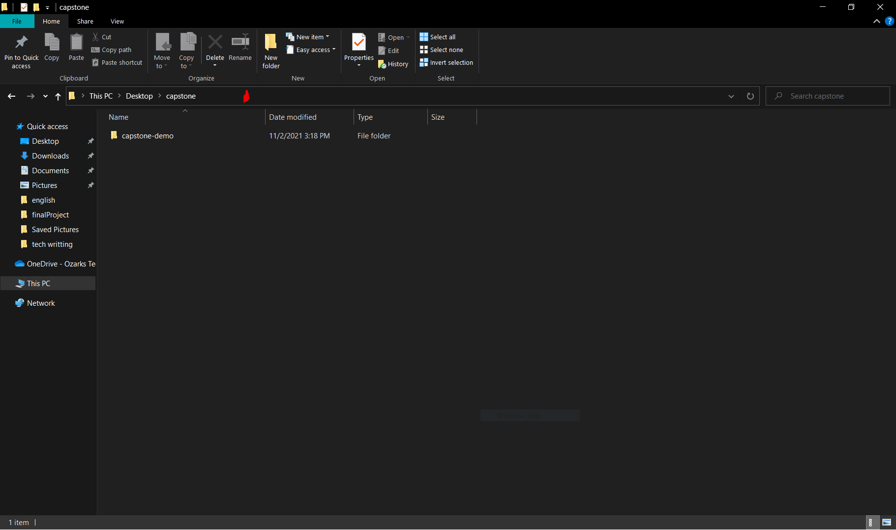
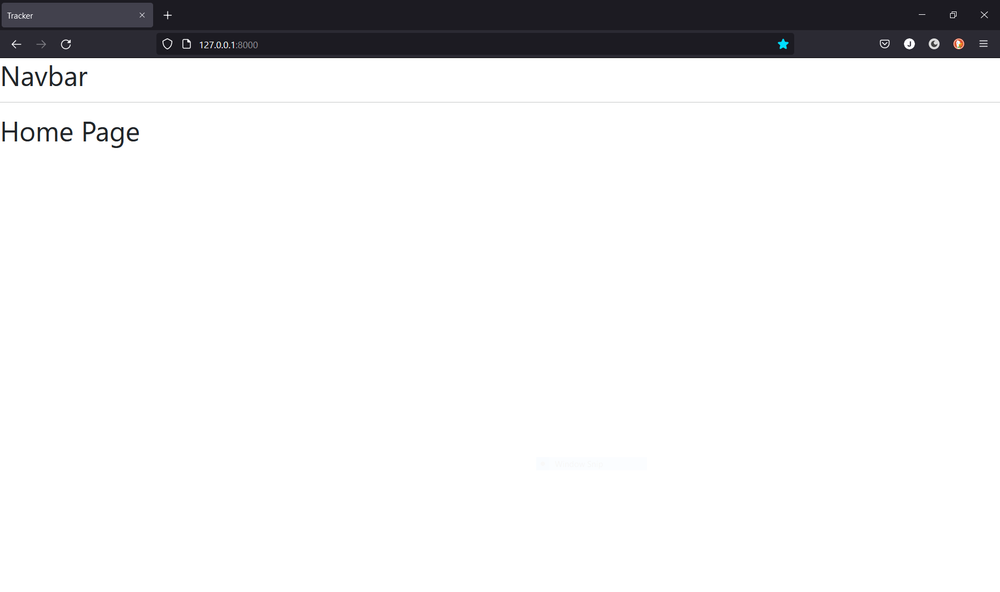

# capstone-demo

# Install project on your local machine
Create folder names 'capstone' in your desktop directory
<br />
Open the capstone folder in your file explorer
<br />
Click where the red blob is in the picture below

<br />
type 'cmd' to open the command prompt in this directory
<br />
Inside the command prompt type the following line
```
git clone https://github.com/JoshPorterDev/capstone-demo.git
```
<br />
Navigate into the project folder using the command

```
cd capstone-demo
```

Install virtualenv
```
pip install virtualenv
```

Create and activate virtualenv
```
virtualenv env
env\Scripts\activate
```

Install requirements
```
pip install -r requirements.txt
```

Start local Dev server
```
python manage.py runserver
```

Navigate to [http://127.0.0.1:8000/](http://127.0.0.1:8000/)
<br />
If everything worked correctly, you should see this screen


# Switch to your branch
In order to try and prevent any issues, I created a branch for each of us to work on. Before you start making any changes to the project, make sure you are on your correct branch by typing
```
git checkout your_name
```

And if you have made changes to the project and want to push your changes to github, make sure you type

```
git push origin your_name
```

# Additional github help
add a remote to your gihub project
after cloning the project, make sure you are in the capstone-demo directory and type the following command in the command prompt
```
git remote add origin https://github.com/JoshPorterDev/capstone-demo.git
```

Make sure you are always on your branch, confirm by typing
```
git branch
```
you should see your name here

When you make changes and wish to commit them to github, type
```
git add .
git push origin your_name
```
You will be asked for your github username and password
<br />
for your password you will need to create a personal access token
<br />
Steps to do this
1. Click on your avatar in the top right of the github website
2. Click settings
3. CLick developer settings
4. Click personal access tokens
5. click generate token
6. under not just put something like capstone
7. for expiration choose 90 days
8. Under scope, check the repo box
9. Scroll down and press generate token
10. Make sure you copy the token and paste it in a file somewhere

Now, when github asks you for your password, you will simply paste the personal access token.


